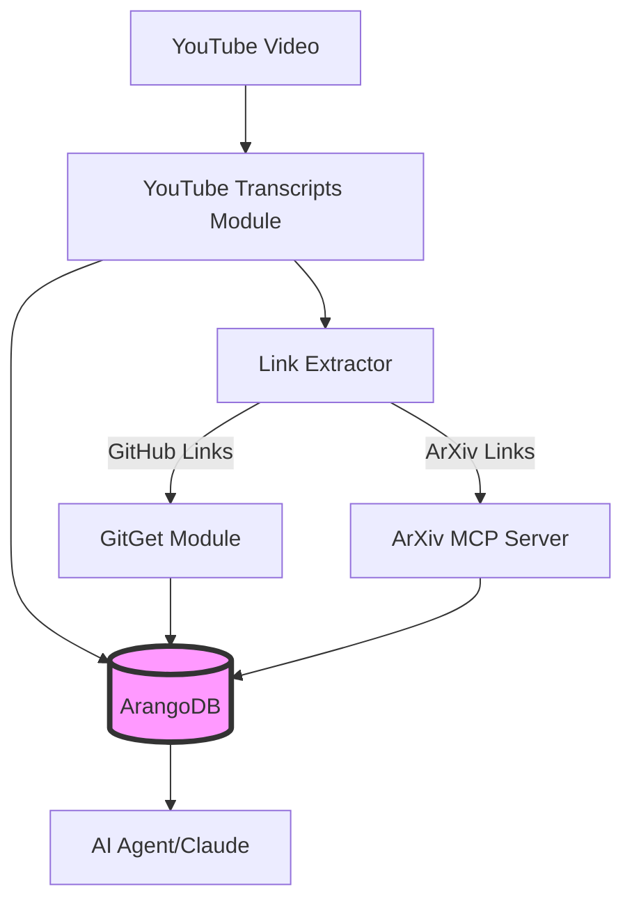

# YouTube + ArXiv + GitGet Integration Strategy

## Overview

This document outlines how YouTube Transcripts, ArXiv MCP Server, and GitGet work together to create a comprehensive research knowledge graph stored in ArangoDB.

## Architecture



## Data Flow

### 1. YouTube Video Processing
```python
# User provides YouTube URL
video_url = "https://www.youtube.com/watch?v=ABC123"

# YouTube Transcripts extracts:
- Video metadata (title, channel, description)
- Full transcript with timestamps
- Comments containing links
- Extracted GitHub repos and arXiv papers
```

### 2. Link Categorization
```python
links = {
    'github_authoritative': [...],  # From video author
    'github_community': [...],      # From comments
    'arxiv_authoritative': [...],   # From video author
    'arxiv_community': [...]        # From comments
}
```

### 3. ArXiv Processing
For each arXiv link found:
```bash
# Use ArXiv MCP Server
arxiv-server search "paper_id:2301.12345"

# Extracts:
- Full paper metadata
- Abstract and authors
- Citations and references
- Related papers
- Code implementation links
```

### 4. GitHub Processing
For each GitHub repository:
```bash
# Use GitGet
gitget analyze https://github.com/author/repo

# Extracts:
- README and documentation
- Code structure and dependencies
- Related repositories
- Issues and discussions
```

### 5. ArangoDB Storage

#### Collections
- `videos`: YouTube video metadata
- `papers`: ArXiv paper details
- `repositories`: GitHub repo information
- `authors`: Video creators, paper authors, code maintainers
- `comments`: Valuable comments with links

#### Edges
- `mentions`: Video → Paper/Repo
- `implements`: Repo → Paper
- `cites`: Paper → Paper
- `depends_on`: Repo → Repo
- `commented_on`: Comment → Video
- `authored_by`: Content → Author

## Use Cases for AI Agents

### 1. Research Exploration
When asked about a topic:
```
User: "How does RLHF work?"
Agent: 
1. Search videos about RLHF
2. Find authoritative papers mentioned
3. Locate implementation code
4. Follow citation chains
5. Synthesize understanding
```

### 2. Code-to-Paper Mapping
```
User: "What papers implement this GitHub repo?"
Agent:
1. Query ArangoDB for repo node
2. Follow 'implements' edges to papers
3. Check video mentions for context
4. Provide comprehensive answer
```

### 3. Authority Ranking
```python
# Prioritize authoritative sources
authoritative_sources = g.V().has('is_authoritative', True)
community_sources = g.V().has('is_authoritative', False)
```

### 4. Research Threads
Follow connected ideas through the graph:
```
Video → Paper → Implementation → Related Papers → More Videos
```

## API Integration

### YouTube Transcripts
```python
from youtube_transcripts import download_youtube_transcript
from youtube_transcripts.link_extractor import ExtractedLink

# Download and extract
transcript_path = download_youtube_transcript(video_url)
```

### ArXiv MCP Server
```python
# Via MCP protocol
{
    "method": "tools/call",
    "params": {
        "name": "search_papers",
        "arguments": {
            "query": "paper_id:2301.12345"
        }
    }
}
```

### GitGet
```python
# Via CLI or API
gitget analyze --url https://github.com/author/repo \
               --output-format json \
               --extract-deps
```

### ArangoDB
```python
from arango import ArangoClient

# Store relationships
db.collection('mentions').insert({
    '_from': 'videos/youtube_ABC123',
    '_to': 'papers/arxiv_2301.12345',
    'is_authoritative': True,
    'timestamp': '2024-01-15'
})
```

## Benefits

1. **Authoritative Sources**: Distinguish between video author claims and community suggestions
2. **Research Trails**: Follow ideas from explanation → theory → implementation
3. **Community Insights**: Valuable corrections and additions from comments
4. **Code Context**: Understand implementations in context of papers
5. **Knowledge Graph**: Rich relationships for AI exploration

## Rate Limiting & Retries

The system uses Tenacity for intelligent retry mechanisms:

### YouTube API Retries
- **Exponential backoff**: 4s → 8s → 16s → 32s → 60s (max)
- **User feedback**: Clear messages when waiting
- **Quota handling**: Graceful degradation when daily quota exceeded

### Example User Experience
```
⏳ YouTube API temporarily unavailable. Will retry in 8 seconds...

⏳ YouTube transcript temporarily unavailable. Will retry in 2.5 minutes...
   This is common when YouTube rate-limits requests. Please be patient.
```

### Best Practices
1. Run from residential IPs (not cloud/VPN)
2. Add delays between batch requests
3. Cache results to avoid repeated API calls
4. Monitor daily quota usage

## Implementation Status

- ✅ YouTube transcript extraction with links
- ✅ Link categorization by source
- ✅ Tenacity retry mechanism
- 🔄 ArXiv integration (via MCP)
- 🔄 GitGet integration
- 🔄 ArangoDB schema design
- 📋 Full pipeline automation

## Next Steps

1. Design ArangoDB schema for all entities
2. Create pipeline orchestrator
3. Implement batch processing
4. Add deduplication logic
5. Build query interfaces for agents